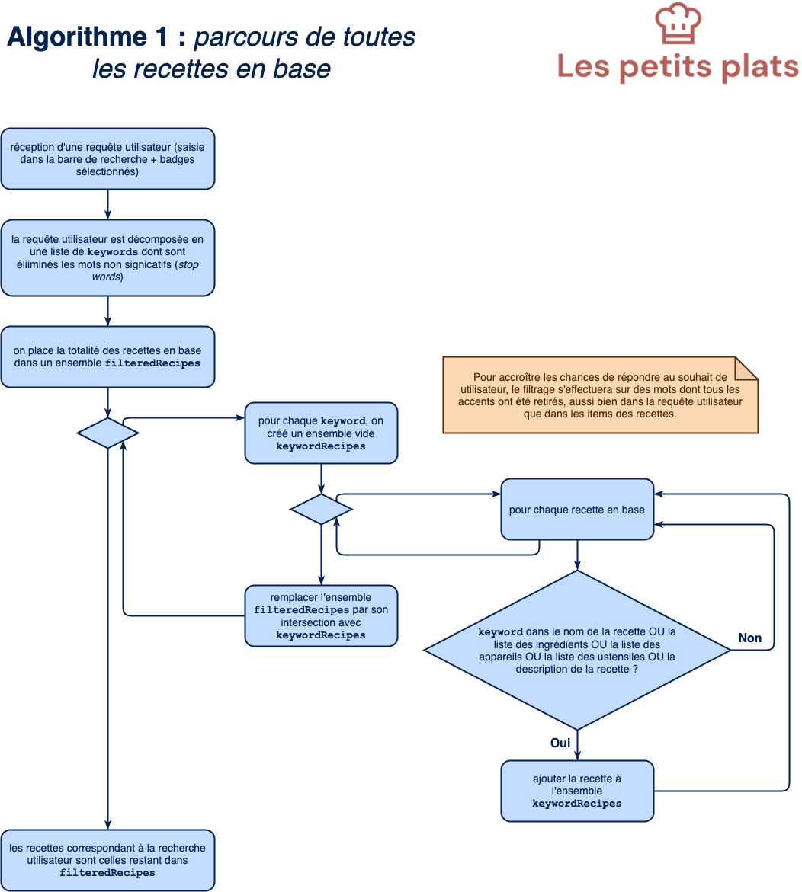
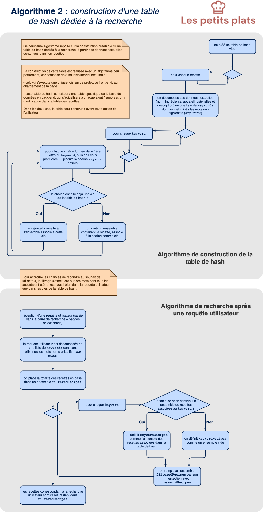

# Les petits plats - Fév 2021

Code source du **Projet 7** - **_Développez un algorithme de recherche en JavaScript_** du parcours **Développeur Front-end** d'_OpenClassrooms_.

## Page de démonstration

Le rendu de ce code est accessible sur cette [GitHub Page dédiée](https://logic-fabric.github.io/LoicMangin_7_27022021/).

## Maquette de l'UI

L'UI de ce projet a été réalisée à partir d'une [maquette Figma](https://www.figma.com/file/xqeE1ZKlHUWi2Efo8r73NK/UI-Design-Les-Petits-Plats-FR?node-id=0%3A1).

## Algorithmes de recherche

